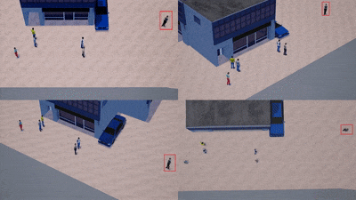
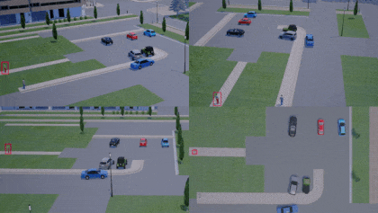
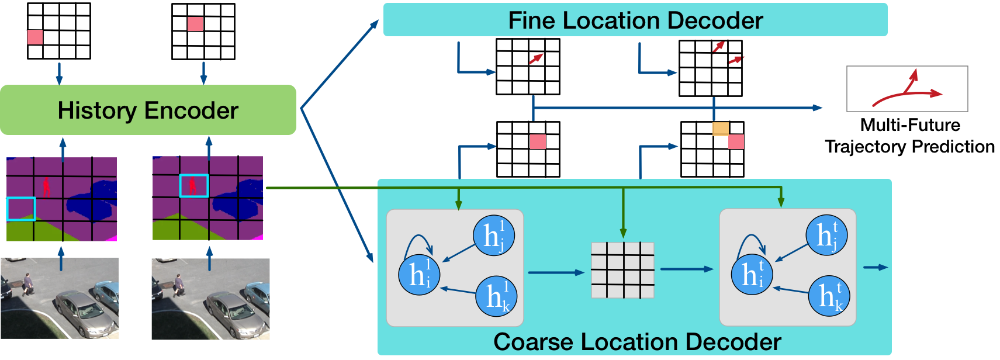
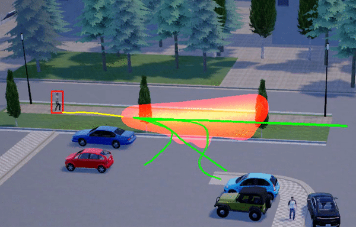
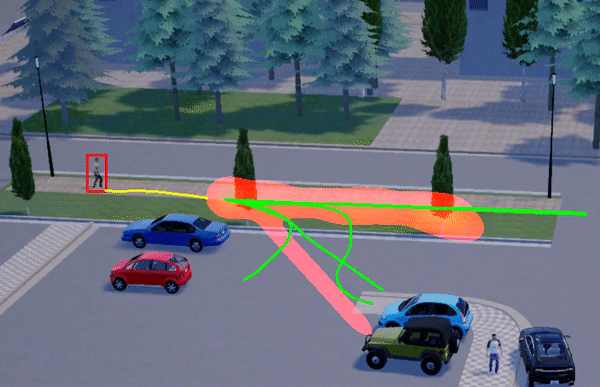

# Multiverse

This repository contains the code and models for the following CVPR'20 paper:

**[The Garden of Forking Paths: Towards Multi-Future Trajectory Prediction](https://arxiv.org/abs/1912.06445)** \
[Junwei Liang](https://www.cs.cmu.edu/~junweil/),
[Lu Jiang](http://www.lujiang.info/),
[Kevin Murphy](https://www.cs.ubc.ca/~murphyk/),
[Ting Yu](https://scholar.google.com/citations?user=_lswGcYAAAAJ&hl=en),
[Alexander Hauptmann](https://www.cs.cmu.edu/~alex/)

You can find more information at our [Project Page](https://next.cs.cmu.edu/multiverse/) and the [blog](https://medium.com/@junweil/cvpr20-the-garden-of-forking-paths-towards-multi-future-trajectory-prediction-df23221dc9f8).

The **SimAug** (ECCV'20) project is [here](SimAug/README.md).

If you find this code useful in your research then please cite

```
@inproceedings{liang2020garden,
  title={The Garden of Forking Paths: Towards Multi-Future Trajectory Prediction},
  author={Liang, Junwei and Jiang, Lu and Murphy, Kevin and Yu, Ting and Hauptmann, Alexander},
  booktitle={The IEEE/CVF Conference on Computer Vision and Pattern Recognition (CVPR)},
  month = {June},
  year={2020}
}
@inproceedings{liang2020simaug,
  title={SimAug: Learning Robust Representations from Simulation for Trajectory Prediction},
  author={Liang, Junwei and Jiang, Lu and Hauptmann, Alexander},
  booktitle={Proceedings of the European Conference on Computer Vision (ECCV)},
  month = {August},
  year={2020}
}
```

# Introduction

<div align="center">
  <div style="">
      
  </div>
  <p style="font-weight:bold;font-size:1.2em;">
    This paper proposes the first multi-future pedestrian trajectory prediction dataset and a multi-future prediction method called Multiverse.
  </p>
</div>

This paper studies the problem of predicting the distribution over multiple possible future paths of people as they move through various visual scenes. We make two main contributions. The first contribution is a new dataset called the **Forking Paths Dataset**, created in a realistic 3D simulator, which is based on real world trajectory data, and then extrapolated by human annotators to achieve different latent goals. This provides the **first benchmark** for quantitative evaluation of the models to predict **multi-future trajectories**.

# The Forking Paths Dataset

+ Current dataset version: v1

+ Download links: [Google Drive](https://drive.google.com/file/d/1yESCQuIdiDNanUSX0qDyzbBRe_AeZB5a/view?usp=sharing) ([sha256sum](https://next.cs.cmu.edu/multiverse/dataset/ForkingPaths_dataset_v1.sha256sum.txt))
/
[Baidu Pan](https://pan.baidu.com/s/1nuc726hX8bUBXmMRj6UBJw) (提取码: tpd7)

+ The dataset includes 3000 1920x1080 videos (750 human-annotated trajectory samples in 4 camera views) with bounding boxes and scene semantic segmentation ground truth. More notes and instructions about the dataset can be found [here](forking_paths_dataset/README.md#annotations).

+ Instructions of how to add more human annotations, edit the scenes, recreate from real-world videos, or **just simply to play with 3D simulator**, can be found [here](forking_paths_dataset/README.md#record-more-annotations).

+ Instructions of how to semi-automatically **re-create real-world videos' scenarios** with homography matrices into 3D simulation can be found [here](forking_paths_dataset/README.md#recreate-scenarios-from-real-world-videos).

<div align="center">
  <div style="">
      
      
  </div>
  <p style="font-weight:bold;font-size:1.2em;">
    <a href="http://www.youtube.com/watch?feature=player_embedded&v=RW45YQHxIhk" target="_blank">Demo Video</a>
  </p>
</div>


# The Multiverse Model

<div align="center">
  <div style="">
      
  </div>
  <br/>
</div>

Our second contribution is a new model to generate multiple plausible future trajectories, which contains novel designs of using multi-scale location encodings and convolutional RNNs over graphs. We refer to our model as Multiverse.


## Dependencies
+ Python 2/3; TensorFlow-GPU >= 1.15.0

## Pretrained Models
You can download pretrained models by running the script
`bash scripts/download_single_models.sh`.

## Testing and Visualization
Instructions for testing pretrained models can be [found here](TESTING.md).

<div align="center">
  <div style="">
      
      
  </div>
  <p style="font-weight:bold;font-size:1.2em;">
    Qualitative analysis between Social-GAN (left) and our model.
  </p>
</div>

## Training new models
Instructions for training new models can be [found here](TRAINING.md).

## Acknowledgments
The Forking Paths Dataset is created based on the [CARLA Simulator](https://carla.org) and [Unreal Engine 4](https://www.unrealengine.com/en-US/).

