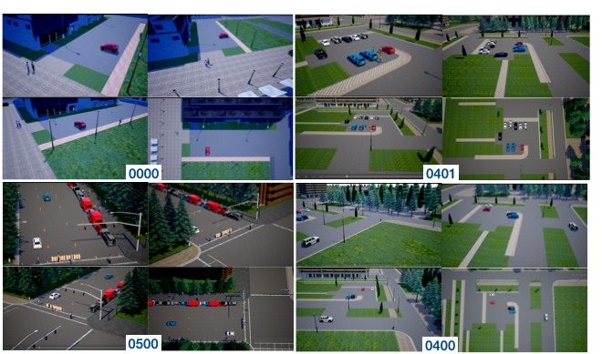
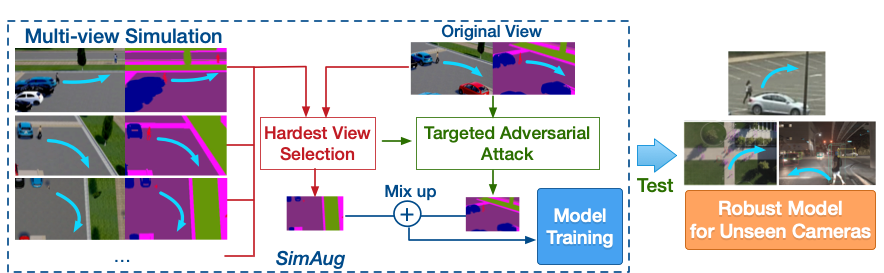

# SimAug

This repository contains the code and models for the following ECCV'20 paper:

**[SimAug: Learning Robust Representations from Simulation for Trajectory Prediction](https://arxiv.org/abs/2004.02022)** \
[Junwei Liang](https://www.cs.cmu.edu/~junweil/),
[Lu Jiang](http://www.lujiang.info/),
[Alexander Hauptmann](https://www.cs.cmu.edu/~alex/)

You can find more information at our [Project Page](https://next.cs.cmu.edu/simaug/).

If you find this code useful in your research then please cite

```
@inproceedings{liang2020simaug,
  title={SimAug: Learning Robust Representations from Simulation for Trajectory Prediction},
  author={Liang, Junwei and Jiang, Lu and Hauptmann, Alexander},
  booktitle={Proceedings of the European Conference on Computer Vision (ECCV)},
  month = {August},
  year={2020}
}
```

# Introduction
<div align="center">
  <div style="">
      
  </div>
  <p style="font-weight:bold;font-size:1.2em;">
    This paper focuses on the problem of predicting pedestrian future trajectories in unseen scenarios and camera views.
  </p>
</div>

This paper studies the problem of predicting future trajectories of people in unseen cameras of novel scenarios and views. We approach this problem through the real-data-free setting in which the model is trained only on 3D simulation data and applied out-of-the-box to a wide variety of real cameras. Checkout our ECCV'20 presentation [here](https://www.youtube.com/watch?v=m6Jd99qUazc).

# Dataset

Here we provide the link to the multi-view trajectory dataset for download.

+ Download links: [Google Drive](https://drive.google.com/file/d/1AgMXXI7VKcB9sqvuWnkW7RlWJOtxlq-Y/view?usp=sharing)
/
[Baidu Pan](https://pan.baidu.com/s/1v4Jo1ZZhE-_fMO6l6axsjQ) (提取码: 6sk5)

+ The dataset includes 5628 1920x1080 videos (1407 reconstructed trajectory samples in 4 camera views) with bounding boxes and scene semantic segmentation ground truth.
+ Video file naming:
Example: VIRAT_S_040000_03_000221_000372_F_1879_obs12_pred16_cam1.mp4
everything before "\_F\_" is the video filename from the original VIRAT dataset, i.e., [videoname]\_F\_[start_frame_idx]\_obs12\_pred16\_cam[camera_idx, 1-4].

<div align="center">
  <div style="">
      
      
  </div>
  <p style="font-weight:bold;font-size:1.2em;">
    Multi-view trajectories reconstructed from the VIRAT dataset.
  </p>
</div>

# The *SimAug* Algorithm

<div align="center">
  <div style="">
      
  </div>
  <br/>
</div>

We propose a novel approach to learn robust representation through augmenting the simulation training data such that the representation can better generalize to unseen real-world test data. The key idea is to mix the feature of the hardest camera view with the adversarial feature of the original view. We refer to our method as **SimAug**. We show that SimAug achieves promising results on three real-world benchmarks using zero real training data, and state-of-the-art performance in the Stanford Drone and the VIRAT/ActEV dataset when using in-domain training data.

## Dependencies
+ Python 2/3; TensorFlow-GPU >= 1.15.0

## Pretrained Models
You can download pretrained models by running the script
`bash scripts/download_single_models.sh`.

## Testing
Instructions for testing pretrained models can be [found here](TESTING.md).

<div align="center">
  <div style="">
      
  </div>
  <p style="font-weight:bold;font-size:1.2em;">
    Qualitative analysis between baseline (blue) and SimAug trained model (orange).
  </p>
</div>

## Training new models
Instructions for training new models can be [found here](TRAINING.md).

## Preprocessing the SDD/Argoverse Dataset
Instructions for processing these can be [found here](PREPRO.md). We have already provided the preprocessed files in the testing instructions.
