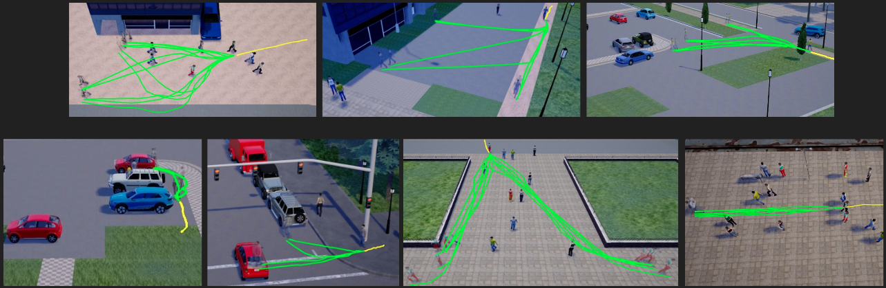

# The Forking Paths Dataset

Download the dataset according to [this](../README.md#the-forking-paths-dataset). This dataset is created based on CARLA 0.9.6.
This is the ForkingPaths dataset rendered in rain just for fun: \[[ForkingPaths_v1_in_Rain](https://drive.google.com/file/d/1Iw0OyVWnJd3XaKmYlO3JBxPFEbLiaf_e/view?usp=sharing)\].
Here are the resources listed in the rest of the sections for downloading:
\[[CARLA_0.9.6_Compiled](http://carla-assets-internal.s3.amazonaws.com/Releases/Linux/CARLA_0.9.6.tar.gz) from [CARLA](https://github.com/carla-simulator/carla/releases/tag/0.9.6)\],
\[[Our_Edited_Maps](https://next.cs.cmu.edu/multiverse/dataset/multiverse_maps_and_statics.tgz)\],
\[[Our_Recreated_Scenarios_Before_Annotation](https://next.cs.cmu.edu/multiverse/dataset/multiverse_scenarios_v1.tgz)\],
\[[ForkingPaths_v1_Annotation](https://next.cs.cmu.edu/multiverse/dataset/forkingpaths_moments_v1.tgz)\],
\[[Anchor_Videos](https://drive.google.com/file/d/16E85MAOqwIGCnKKLDAzQ4Q3cMjS27mrG/view?usp=sharing)\],
\[[Our_Entire_CARLA_Workspace](https://drive.google.com/file/d/18zIMtWpmaq4nYHpdrTxNPFwE7EgK13qU/view?usp=sharing)\],


## Content
1. [Annotations](#annotations)
2. [Prepare Data](#prepare-data)
3. [Visualize the Dataset](#visualize-the-dataset)
4. [Record More Annotations](#record-more-annotations)
5. [Edit the Maps](#edit-the-maps)
6. [Recreate Scenarios from Real-world Videos](#recreate-scenarios-from-real-world-videos)
7. [Change Agent Trajectories](#change-agent-trajectories)
8. [Future Work](#future-work)


## Annotations
This dataset is for multi-future trajectory prediction. The common experiment setting for trajectory prediction is to let the model observe a period of time (3.2 seconds) and then predict the future 4.8 seconds. We set the observation time period in this dataset to be 4.8 seconds and the future period to be up to 10.4 seconds. For videos of the same scenario (we call it a "moment" in the code), the observation period would be the same and the future period would be different. See Section 4 in the paper for more details.

+ The dataset includes 3000 videos. The filenames are in [scene]\_[moment_id]\_[controlled_agent_id]\_[destination_idx]\_[annotator_id]\_[camera_idx] format. There are 508 unique observation trajectories, which are identified by [scene]\_[moment_id]\_[controlled_agent_id]\_[camera_idx] \(so the destination and annotator variances make the multi-future trajectories\).

+ The bounding box annotations are in JSON format, which include annotations for every agent for every time frame. FPS for ETH/UCY scene (zara01, eth, hotel) is 25.0 and the rest is 30.0. The JSON files look like this:
```
[
  {
    "class_name": "Person",  # either "Person" or "Vehicle"
    "is_x_agent": 1,  # whether it is a controlled agent
    "bbox": [1535.1, 55.443, 32.5920000000001, 33.919],  # [x, y, w, h]
    "frame_id": 0,  # 0-indexed time frame index.
    "track_id": 9.0,  # ID of the person/vehicle
  },
  ...
]
```

+ The scene semantic segmentation ground truth is encoded in MP4 videos. See [here](https://carla.readthedocs.io/en/0.9.6/cameras_and_sensors/) for scene classes and coloring. See [this code](code/get_frames_and_scene_seg.py) for examples of converting segmentation videos to Numpy format.

## Prepare Data
Here are instructions to prepare data for testing like the [Next-Prediction](https://github.com/google/next-prediction) repo.

+ Download the dataset according to [here](../README.md#the-forking-paths-dataset). Assuming you have the dataset in this folder
```
$ tar -zxvf ForkingPaths_dataset_v1.tgz
```

+ Step 1, get data split (in the paper we use the whole Forking Paths dataset for testing. The model is trained on VIRAT/ActEV dataset, same as [Next-Prediction](https://github.com/google/next-prediction)).
```
$ python code/get_split_path.py next_x_v1_dataset/rgb_videos/ \
next_x_v1_dataset/data_splits
```

+ Step 2, get trajectories and bounding boxes in format that is compatible with the [Next-Prediction](https://github.com/google/next-prediction) repo and the [Social-GAN](https://github.com/agrimgupta92/sgan) repo.
```
$ python code/get_prepared_data_multifuture.py next_x_v1_dataset/ \
next_x_v1_dataset/data_splits/ next_x_v1_dataset_prepared_data/obs_data \
next_x_v1_dataset_prepared_data/multifuture
```
`next_x_v1_dataset_prepared_data/obs_data/traj_2.5fps` will contain trajectory
files that are inputs to Social-GAN.

+ Step 3, extract RGB frames from the videos and convert scene segmentation videos to Numpy format.

```
$ python code/get_frames_and_scene_seg.py next_x_v1_dataset_prepared_data/obs_data/traj_2.5fps/ \
next_x_v1_dataset/rgb_videos/ next_x_v1_dataset/seg_videos/ \
next_x_v1_dataset_prepared_data/obs_data/rgb_frames \
next_x_v1_dataset_prepared_data/obs_data/scene_seg/ \
next_x_v1_dataset_prepared_data/obs_data/bad_video.lst \
--scene_h 36 --scene_w 64 --is_multifuture
```

Now you can follow [this](../TESTING.md#multi-future-trajectory-prediction) to run multi-future inferencing with the Multiverse model. Optionally, to run [Next-Prediction](https://github.com/google/next-prediction) on this dataset, you can follow [this](https://github.com/JunweiLiang/next-prediction/blob/master/code/prepare_data/README.md#step-5-get-person-appearance-features) to extract person appearance features based on the RGB frames and person bounding boxes we get from Step 2 and 3.

## Visualize the Dataset
To get the cool multi-future visualization like the following, run this:
```
$ python code/visualize_multifuture_dataset.py next_x_v1_dataset/rgb_videos/ \
 next_x_v1_dataset/bbox/ next_x_v1_dataset_prepared_data/multifuture/test/ \
 multifuture_visualization
```
<div align="center">
  <div style="">
      
  </div>
</div>

<div align="center">
  <div style="">
      
  </div>
  <p>
      We have collected multi-future trajectories from 7 scenes.
  </p>
</div>


## Record More Annotations
In this section, I will show you how to use our code and [CARLA](https://carla.org) simulator to get more human annotations like the following. [Here](../images/annotation_environment.jpg) was our annotation environment.

<div align="center">
  <div style="">
      
  </div>
  <p style="font-weight:bold;font-size:0.9em;">
    This is the human annotation procedure. Annotators are provided with a bird-eye view of the scene first and then they are asked to control the agent to go to the destination. More to see in <a href="https://youtu.be/FJTJquN2Kj4" target="_blank">this video</a>
  </p>
</div>

### Some basics
In order to simulate a **scenario** (in the code it is referred to as "moment") where a number of "Person" and "Vehicle" agents navigate in the scene for a period of time, the simulator needs to know exactly how to control each agent at each time frame. For "Person" agent the control means the direction and velocity. For "Vehicle" agent, we teleport them to the desire location and remove the physics simulation for simplicity (As of CARLA 0.9.6, it is not trivial to accurately convert direction and velocity to vehicle controls like throttling and steering. And teleporting looks smooth enough if we do it at every time frame.) So basically we need: 1. the **static map**, 2. the **full control records** of every agents at all time frames, for the simulation to run. To get human-annotated multi-future trajectories, the idea is to first recreate a plausible scenario that resembles the real-world, and then ask a human annotator to "drop-in" or "embody" a "Person" agent, and control such an agent to continue to a destination. The control record of the human annotator along with other agents' are saved as a JSON file. We leave multi-human simultaneous annotation to future work. The following requires Python3.

### Step 1, prepare and test the CARLA simulator
Get the CARLA simulator from [here](http://carla-assets-internal.s3.amazonaws.com/Releases/Linux/CARLA_0.9.6.tar.gz) and our edited maps from [here](https://next.cs.cmu.edu/multiverse/dataset/multiverse_maps_and_statics.tgz) or by:
```
$ wget http://carla-assets-internal.s3.amazonaws.com/Releases/Linux/CARLA_0.9.6.tar.gz
$ wget https://next.cs.cmu.edu/multiverse/dataset/multiverse_maps_and_statics.tgz
```
Put the maps into the CARLA package:
```
$ mkdir CARLA_0.9.6/; cd CARLA_0.9.6/; tar -zxvf ../CARLA_0.9.6.tar.gz
$ cd ../; tar -zxvf multiverse_maps_and_statics.tgz;
$ cp multiverse_maps_and_statics/Town0* CARLA_0.9.6/CarlaUE4/Content/Carla/Maps/
$ cp multiverse_maps_and_statics/Road/Town05_TerrainNode_125.u* CARLA_0.9.6/CarlaUE4/Content/Carla/Static/Road/RoadsTown05/
$ cp multiverse_maps_and_statics/Vegetation/Town05_TerrainNode_125.u* CARLA_0.9.6/CarlaUE4/Content/Carla/Static/Vegetation/
```
Now you should be able to start a CARLA simulator server. The package should work out-of-the-box. I have tested it on RTX 2060/TITAN X/GTX 1080 TI GPU machine with Nvidia-430 or above drivers and on Ubuntu 16/18. Start CARLA server by:
```
$ cd CARLA_0.9.6/; ./CarlaUE4.sh -opengl -carla-port=23015
```
A spectator window should popup. Then open another terminal to test the new maps. Start an observer client with a PTZ camera to play around:
```
# install pygame
$ python code/spectator.py --port 23015  --change_map Town05_actev
```
Both windows should be switched to a new map. For full keyboard and mouse controls of the spectator window, see [here](code/spectator.py#L136). Now, press Ctr+C to exit both terminals.


### Step 2, get recreated scenarios
To add more human annotations, we start with recreated scenarios (We will talk about how to create scenarios from real-world videos or from scratch in the next section).
Download the scenarios from [here](https://next.cs.cmu.edu/multiverse/dataset/multiverse_scenarios_v1.tgz) or by:

```
$ wget https://next.cs.cmu.edu/multiverse/dataset/multiverse_scenarios_v1.tgz
# sha256sum: f25a02f3a362c8e05823f17b20e5c12224be0559849f46ae3143abc1828f8051
```

We'll need to make two file lists since we use two different maps.
```
$ tar -zxvf multiverse_scenarios_v1.tgz
$ cd multiverse_scenarios_v1/
$ ls $PWD/0* > actev.lst
$ ls $PWD/eth.fixed.json $PWD/zara01.fixed.json $PWD/hotel.fixed.json > ethucy.lst
```

### Step 3, human annotation
Start the CARLA server in the background:
```
$ cd CARLA_0.9.6/; DISPLAY= ./CarlaUE4.sh -opengl -carla-port=23015
```

You can change the port to others. Now, open another terminal and:
```
$ python code/annotate_carla.py multiverse_scenarios_v1/actev.lst actev.junwei.json \
actev.junwei.log.json --video_fps 30.0 --annotation_fps 2.5 --obs_length 12 \
--pred_length 26 --is_actev --port 23015
```

Now a pygame window should pop up and there will be instructions in the window for annotators. For ETHUCY, change to `ethucy.lst` and `--video_fps 25.0` and remove `--is_actev`.
The annotator is asked to control the agent to reach the destination within 10.4 seconds and not to collide with any other agents. Each annotation session will restart if the above condition fails. Currently we use a third-person camera for the annotation since it helps the annotator to get a better sense of their surroundings, as currently the agent controls are limited (e.g., it is not trivial to use mouse to control agent's neck movement). You can change the annotator's camera setting [here](code/annotate_carla.py#L670).
It would be cool to have VR headset connected to CARLA for the human annotator in [future work](#future-work).


### Step 4, data cleaning
Suppose you have a couple of annotators and each of them generates a JSON file from Step 3, we need a file list of these JSONs and their annotator ID:
```
$ echo "$PWD/actev.junwei.json 27" >> actev_annotations.lst
...
```

Now, make a single "moment" record JSON:
```
$ python code/gen_moment_from_annotation.py multiverse_scenarios_v1/actev.lst \
actev_annotations.lst actev.final.json --video_fps 30.0 --annotation_fps 2.5 \
--obs_length 12 --pred_length 26
```

Now, before recording the final videos, we should clean the data by manually looking at all the annotated trajectories and remove outliers. Start the server if it is not running:
```
$ cd CARLA_0.9.6/; DISPLAY= ./CarlaUE4.sh -opengl -carla-port=23015
```

Start the "moment" editor client:
```
$ python code/moment_editor.py actev.final.json actev.final.checked.json \
 --video_fps 30.0 --is_actev --annotation_fps 2.5 --port 23015
```

Click "[" or "]" to cycle through the annotated trajectories. Click "g" to replay each annotated trajectory. Click "o" to approve all trajectories. See [here](code/moment_editor.py#L139) for full controls. Close the window and a new JSON file is saved to `actev.final.checked.json`.

<div align="center">
  <div style="">
      
  </div>
  <p style="font-weight:bold;font-size:0.9em;">
    You can use the moment editor to edit or even create from scratch a person-vehicle scenario. The vehicle movements will be interpolated in the final recordings so it will be much smoother. See more in <a href="https://youtu.be/MktcrwkbNC4" target="_blank">this video</a>.
  </p>
</div>

[Here](https://next.cs.cmu.edu/multiverse/dataset/forkingpaths_moments_v1.tgz) are the final annotated JSONs of the **ForkingPaths dataset v1**.

### Step 5, now that we have the annotations, we could record videos!

Now we can start recording videos and get ground truth annotations including bounding boxes and scene semantic segmentation.
```
$ python code/record_annotation.py --is_actev --res 1920x1080 --video_fps 30.0 \
 --annotation_fps 2.5 --obs_length 12 --pred_length 26 actev.final.checked.json \
 new_dataset --port 23015
```

For ETHUCY, remove `--is_actev` and change `--video_fps 25.0`. The recording is done in the background and 4 cameras are used simultaneously to record the simulation.
The camera views are set manually by using `code/spectator.py` to find the right camera view (Location, Rotation, Field of View).
See the scene-specific camera parameters [here](code/utils.py#L201).
We also manually tune the weather parameters [here](code/utils.py#L80) to make the shadow's length and direction match the one in the real videos.
The output folder should have the same structure as our released dataset.


## Edit the Maps
To edit the map, you will need the Unreal Engine 4 and build CARLA from source. Follow [this guide](https://carla.readthedocs.io/en/0.9.6/how_to_build_on_linux/) to build UE4 (version 4.22.3) and CARLA 0.9.6. I haven't tested the latest CARLA for this project yet.

After you have installed UE4, this is an example to get CARLA 0.9.6 source code and launch **CARLA-UE4** editor:
```
$ git clone https://github.com/carla-simulator/carla
$ cd carla
$ git checkout e2c4dc1312fe04c99147cf7403b39eba910271ba
$ ./Update.sh
$ export UE4_ROOT=Your_path_to/UnrealEngine/
$ make launch
```
In the UE4 editor, I simply duplicate existing CARLA map first (Town05 and Town03), and then edit them to look like the ActEV or ETHUCY videos. Then save the maps.
Now, cook the maps so that you can use it in the CARLA simulator. The following is an example:
```
$ UnrealEngine_4.22/Engine/Binaries/Linux/UE4Editor \
carla_source_09272019/Unreal/CarlaUE4/CarlaUE4.uproject -run=cook \
-map=carla_source_09272019/Unreal/CarlaUE4/Content/Carla/Maps/Town03_ethucy.umap \
-cooksinglepackage -targetplatform="LinuxNoEditor" \
-OutputDir=carla_source_09272019/Unreal/CarlaUE4/Content/Carla/ExportedMaps/ETHUCY_map
```
Suppose you call the new map "Town03_ethucy", then you will have Town03_ethucy_BuiltData.* in the "ETHUCY_map" directory. These are the files we share in Step 1 of the previous section. See the previous section for how to use them.
[Here](https://drive.google.com/file/d/18zIMtWpmaq4nYHpdrTxNPFwE7EgK13qU/view?usp=sharing) is the entire workspace code I have in case you want to poke around.

If you meet any problems, [here](https://github.com/JunweiLiang/Multiverse/issues/2#issuecomment-653431734) are some more instructions provided by [@huikunbi](https://github.com/huikunbi) to load the maps and assets.

## Recreate Scenarios from Real-world Videos
Given real-world videos with homography matrics between the video frame and the ground plane (and bounding boxes), we could almost automatically recreate the scenarios in the simulator, given that we already have the static scenes reconstructed. Here are instructions for recreating the ActEV dataset.

<div align="center">
  <div style="">
      
  </div>
  <p style="font-weight:bold;font-size:1.0em;">
    In this section you will learn how to recreate scenarios from real-world videos into 3D simulation like this.
  </p>
</div>

### Step 1, get person & vehicle trajectories in world coordinates
Download trajectory data from [Next-Prediction](https://github.com/google/next-prediction) and homography matrics (note that we use 0502 scene's homography matrix to replace 0500's since the original one is not accurate):
```
$ wget https://next.cs.cmu.edu/data/final_annos.tgz
$ wget https://next.cs.cmu.edu/multiverse/dataset/actev_homography_0502to0500.tgz
$ tar -zxvf final_annos.tgz; tar -zxvf actev_homography_0502to0500.tgz
```

Compute ground plane trajectories with the homography matrics:
```
$ mkdir actev_trajs/
$ python code/combine_traj.py final_annos/actev_annos/virat_2.5fps_resized_allfeature/ \
 actev_trajs/pixel actev_trajs/all_frames.json --is_actev \
 --h_path actev_homography_0502to0500 --target_w_path actev_trajs/world
```

Get the vehicle trajectories:
```
$ wget https://next.cs.cmu.edu/data/actev-v1-drop4-yaml.tgz
$ tar -zxvf actev-v1-drop4-yaml.tgz
$ mkdir actev_all_annotations/
$ find actev-v1-drop4-yaml/ -name "*.yml" | while read line;do mv $line actev_all_annotations/; done
# need pyyaml >= 5.1; $ sudo pip install --ignore-installed -U PyYAML
$ python code/get_vehicle_traj.py actev_trajs/pixel/ actev_all_annotations/ \
actev_homography_0502to0500/ actev_vehicle_trajs
```

For ETH/UCY (ZARA1, ZARA2, ETH, HOTEL), this is how you get the world coordinates:
```
# do the following for eth,hotel,zara1,zara2
$ mkdir ethucy_trajs/
$ python code/combine_traj.py final_annos/ucyeth_annos/original_trajs/eth/ \
 ethucy_trajs/world ethucy_trajs/all_frames.json --reverse_xy
$ cp -r final_annos/ucyeth_annos/traj_pixels ethucy_trajs/pixel
```

### Step 2, get the appropriate calibration parameters (origin, rotation, etc.) to convert trajectories into CARLA map-specific coordinates
In this step, we need to plot the trajectories in the simulation scene to see whether they make sense. So first start the CARLA server:
```
$ cd CARLA_0.9.6/; DISPLAY= ./CarlaUE4.sh -opengl -carla-port=23015
```

Then open another terminal and start an spectator client and move to the anchor view of the scene (use 0000 as an example):
```
$ python code/spectator.py --port 23015 --change_map Town05_actev \
--go_to_0000_anchor --set_weather
```

Plot the trajectories and repeat until you find them reasonably align with the static scenes. Click on the ground of the **spectator window** to see the world xyz, and then a second click to get the rotation degree.
```
$ python code/plot_traj_carla.py actev_trajs/world/VIRAT_S_000000.txt 4860 \
3.5 -48 0.3 130 --world_rotate 320 --scale 1.0 --is_actev \
--vehicle_world_traj_file  actev_vehicle_trajs/world/VIRAT_S_000000.txt \
--port 23015
```

Put the calibration parameters from each scene into `code/batch_plot_traj_carla.py`. Convert all trajectories into CARLA world coordinates:
```
$ python code/batch_plot_traj_carla.py actev_trajs/world/ actev_carla_pedestrian/ \
--traj_vehicle_world_path actev_vehicle_trajs/world/ \
--save_carla_vehicle_path actev_carla_vehicle
```

For ETH/UCY, first change map to `Town03_ethucy`:
```
$ python code/spectator.py --port 23015 --change_map Town03_ethucy \
--go_to_zara_anchor --set_weather
$ mkdir ethucy_carla_pedestrian/
```

zara calibrations:
```
# the first command plots into carla, the second generates a new file
$ python code/plot_traj_carla.py ethucy_trajs/world/crowds_zara01.txt \
0 -44.0511921243 -79.6225002047 0. -3.0428182023594172 \
--world_rotate 270 --scale 1.2 --port 23015
$ python code/plot_traj_carla.py ethucy_trajs/world/crowds_zara01.txt \
0 -44.0511921243 -79.6225002047 0. -3.0428182023594172 \
--world_rotate 270 --scale 1.2 \
--save_carla_traj_file ethucy_carla_pedestrian/zara01.txt
```

eth:
```
$ python code/plot_traj_carla.py ethucy_trajs/world/seq_eth.txt \
850 32 -53.0 8.25534259124 2.4 --world_rotate 0 --scale 1.2 \
--save_carla_traj_file ethucy_carla_pedestrian/eth.txt
```

hotel:
```
$ python code/plot_traj_carla.py ethucy_trajs/world/seq_hotel.txt \
0 72.2222050133 -109.035342615 8.248 92.53 --world_rotate 0 --scale 1.0 \
--save_carla_traj_file ethucy_carla_pedestrian/hotel.txt
```

To take a look at what the moments look like, try this:
```
$ python code/build_moment.py ethucy_carla_pedestrian/zara01.txt 0 200 --port 23015
```
This will run the simulation from frame 0 to 200 for the ZARA01 scene. You may notice a lot of collisions, which may be due to homography matrix error, simulation error, etc. Follow the next step to filter them.

### Step 3, run simulations to remove scenarios with collisions
Start the CARLA server if you haven't already. To check individual scenarios, start a spectator first:
```
$ python code/spectator.py --port 23015 --change_map Town05_actev \
--go_to_0000_anchor --set_weather
```

Start individual moment to see it on the spectator:
```
$ python code/build_moment.py actev_carla_pedestrian/VIRAT_S_000000.txt \
4716 4956 --vehicle_traj actev_carla_vehicle/VIRAT_S_000000.txt \
--vehicle_z 0.2 --port 23015
```

It is not practical to manually check every reconstructed scenarios. Run the following to get scenarios that are collision-free so that we could use them for candidates for human annotations (and also the CARLA world coordinates will be converted to agent controls):
```
$ python code/auto_moment_candidates.py actev_carla_pedestrian/ --is_actev \
--vehicle_traj_path actev_carla_vehicle/ --moment_length 15.2 --test_skip 10 \
actev_candidates_m15.2_skip10 --port 23015
```

Now optionally you can use these scenario JSONs in `actev_candidates_m15.2_skip10` to record videos. Follow [this guide](#step-5-now-that-we-have-the-annotations-we-could-record-videos) in previous section. [Here](https://drive.google.com/file/d/16E85MAOqwIGCnKKLDAzQ4Q3cMjS27mrG/view?usp=sharing) are the collision-free videos we recreated (we call them "anchor videos"). These videos and annotations are used for the "Trained on Sim." experiments.

### Step 4, manually check the filtered scenarios and prepare for multi-future annotations
Manually go through all filtered scenarios and find those that are suitable for multi-future trajectories.
```
$ mkdir actev_final/
$ python code/moment_editor.py actev_candidates_m15.2_skip10/0000.json \
actev_final/0000.fixed.json --is_actev --video_fps 30 --annotation_fps 2.5 \
--obs_length 12 --pred_length 26 --port 23015
```

Click "[" or "]" to cycle through the annotated trajectories. Click "g" to replay each annotated trajectory. Click "o" to approve all trajectories. Click "x" to set the current selected agent as "x agent" (the agent that will be "embodied" by human annotator).
See [here](code/moment_editor.py#L139) for full controls. Close the window and a new JSON file is saved to `actev_final/0000.fixed.json`.
This is how we get the [scenarios before human annotations](https://next.cs.cmu.edu/multiverse/dataset/multiverse_scenarios_v1.tgz).

## Change Agent Trajectories
To manually change all agents trajectories of the forking path dataset, you can do so with the moment editor to get new JSON data files. Specifically, follow [Step 4](#step-4-manually-check-the-filtered-scenarios-and-prepare-for-multi-future-annotations) of the previous section to open the original trajectory control files with `moment_editor.py`, and then edit the trajectories accordingly. A new JSON data file will be saved. Then you can follow [this step](#step-5-now-that-we-have-the-annotations-we-could-record-videos) to record new videos and annotations.


## Future Work
Many exciting directions can be explored based on this work.
+ Simply update to the latest version of CARLA with better pedestrian animation.
+ Better agent controls. Add mouse controls to control the agent's neck movement so annotators can get better sense of their surroundings during annotations. Or we could even attach a VR headset to CARLA if it is supported.
+ Small improvements including out-of-frame agent interpolations (so they don't just disappear), spawn-time jittering (so their animation won't be in sync), adding correct initial rotation
+ Multi-human multi-future trajectory. Asking multiple human annotators to control agents in the scenario at the same time.
+ Human driver behavior prediction. We could create a complex situation with pedestrians and vehicles and a human annotator is asked to drive a car across to a destination.
+ Activity reconstruction. CARLA has added bone controls in later versions, which could be used to automatically get pedestrian agents to perform complex activities.


